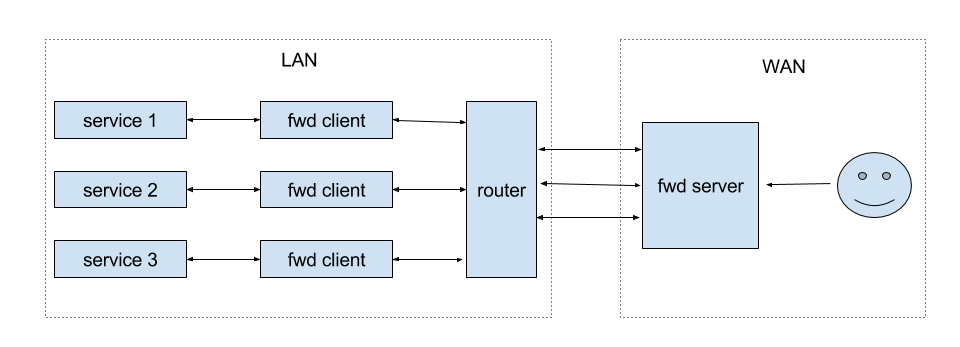

# fwd
yet another dual reverse proxy



##Usage

```
  -D string
    	user defined description (default "default")
  -l	server mode
  -m string
    	local port:remote port (default "3333:4444")
  -s string
    	fwd server (default "localhost:60010")
```

##Example

1. Launch fwd server on your VPS (or any server with a public IP): `./fwd -l -s 0.0.0.0:3333`
2. Launch fwd client on your local machine, for example: a raspberry pi behind a router. `./fwd -m 22:4444 -s [public ip]:3333`
3. fwd will listen on port 4444 and forwarding the data stream to port 22 of your local machine. 
